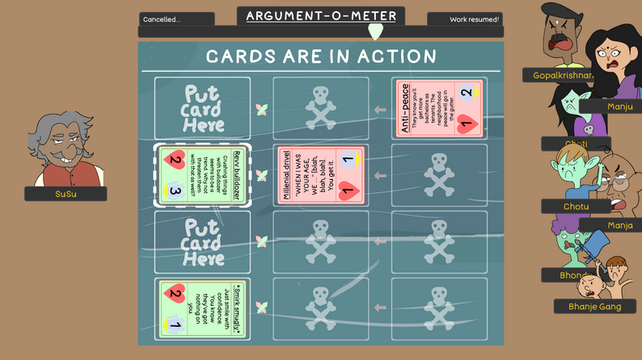

# Tygoon

  
  

      A card-based combat game, with a lot of fun flavour text. Experience the journey of Surendra Sukarkar (or SuSu for short) as he tries to become a real estate tycoon.
  

  
   

  
  

  This game was made as a submission to the <a href='https://itch.io/jam/wtfxigdc/rate/2845559'>WTFxIGDC Game Jam 2024</a>.
  

   
  <a href=''>Trailer</a> (Doesn't exist yet)
   
  <a href='https://stashatstake.itch.io/tygoon'>Link to play</a>
  
   

  
  <h1> Gallery </h1>
  
  

  
  
  

  
  
  

  
  
  

  
  
  
  <h1> Prerequisites </h1>
  <ul>
      <li>
        <a href='https://unity.com/releases/editor/whats-new/2021.3.10'> Unity Engine ver 2021.3.10f1 </a>
      </li>
  </ul>   

  <h1> Co-author </h1>
  

      <a href='https://github.com/RobinTheHoo'> RobinTheHoo </a>
  

